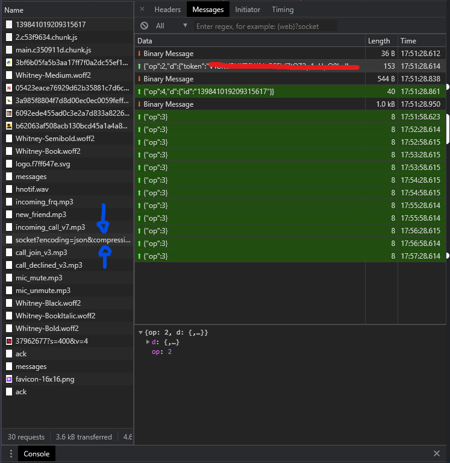

# Hiven.py
Welcome to the unofficial hivenpy api wrapper. So far we only have self bots as bot account aren't made yet. 
This is a work in progress project made by NexInfinite, CanCodes, and Xenen.

# How to use
At the moment we dont have a pip package set up as its not at that stage yet but you can still make 
self bots with this.
####Step 1
Get your AUTH and TOKEN from the networks tab of Hiven (on the bot account).
- TOKEN - Go to the blue arrows and your token is the red line

####Step 2
Download the code and place it in your project. You will then need to add 
```python
import bot as b
from bot import events
```
This will import the bot and events. After this you will need to type
```python
TOKEN = "Your token from before"
bot = b.Bot(TOKEN)
```
You can also set `debug=True` if you want debugs from the websocket and `output=True` if you want outputs 
from each websocket message.

####Step 3
Next you will need to setup the events and login to the bot. To do this please type:
```python
@events.event
def on_message(ctx):
    if ctx.author.id != bot.user.id:  
        # Do stuff

bot.login()
```
Congratulations! You now have a self bot for hiven! 

# Please note
This is a work in progress project so everything is going to change soon. This is temporary so you can start making
and experimenting with new bots now.
<br><br>
There is also no documentation as of yet but there will be in the future. Feel free to message me on hiven
@nexinfinite (I am in the hiven testers chat) to get some support. The house will be public soon, we are 
waiting for that to be released.
